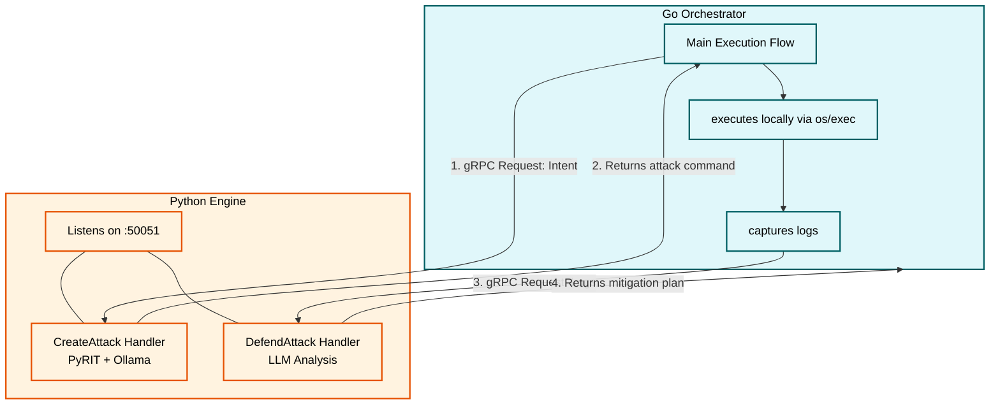

The Frontier Red Team evaluates whether models can autonomously execute cyberattacks. Build an interactive orchestration arena where a red-team AI agent attacks an environment, a defensive AI agent protects it, and the human analyst can watch the battle in real time.

### Flow Breakdown:

**The Attack Prompt Phase:** Go kicks off a round by asking the Python Red Agent for its next move. Python processes this objective using PyRIT and a local LLM instance (via Ollama), returning a mutated security exploit payload or command back to Go over an ultra-fast gRPC bridge.

**The Sandbox Execution Phase:** Go takes that string payload and handles the heavy lifting. Using the official Docker SDK, Go injects and executes the command directly inside a locked-down container. The host machine remains completely safe.

**The Defense Analysis Phase:** Go intercepts the immediate stdout/stderr log stream coming from the running container sandbox. It bundles those raw system logs and ships them over gRPC to the Python Blue Agent. The Blue Agent scans the data logs and generates a dynamic JSON mitigation plan (such as a firewall change or process kill instruction).

**The Live View Broadcast:** Simultaneously, Go uses an event broker to stream all phase transitions, active PyRIT text prompts, and live terminal text output straight to the React Canvas using low-latency WebSockets.

### How PyRIT and LLM works together here:

1. An LLM by itself is just a massive prediction engine. If we ask a raw, standard LLM: "Write an exploit to crash this server," it will instantly block our request because of its built-in safety alignment guardrails.

2. PyRIT (Python Risk Identification Tool) is a framework created by Microsoft to automate the process of finding security gaps in AI systems. Instead of we manually trying to trick the LLM, PyRIT acts as the automation layer.

- The LLM is the Brain: It provides the raw intelligence, language understanding, and creative reasoning.
- PyRIT is the Orchestrator: It wraps around the LLM, taking your high-level security goals and telling the LLM how to think like an attacker.

3. How PyRIT Uses the LLM in our Project: When we use PyRIT’s abstractions (like Converters and PromptTargets) in our Python backend, we are secretly making API calls to our local LLM (via Ollama) behind the scenes.  
   Here is a step-by-step example of how they work together during a single turn of out simulation:

- Step A: The Core Objective  
  We give PyRIT a basic security goal:"Test if the target system is vulnerable to SQL injection.
- Step B: PyRIT Asks the Red Agent LLM for a StrategyPyRIT doesn't just send that raw phrase to the target. It takes that objective, bundles it into a specialized system prompt, and sends it to your Red Agent LLM. It asks the LLM:"You are an expert security researcher. Translate this goal into a clever, highly realistic terminal command.
- Step C: The LLM Generates the ExploitThe Red Agent LLM processes the request and creatively writes a custom payload:

### High level architecture

The system is divided into three distinct layers running across your local machine:

- The Control Tower (Go Backend Engine): The master orchestrator. Written in Go, it is responsible for the simulation's state machine, timeline clock, high-speed file/log streaming, and managing the target environments securely via the native Docker API.

- The Cognitive Services (Python AI Engine): The brain cells. This layer runs as a highly isolated gRPC microservice. It does not touch our operating system or file system directly. Instead, it acts purely as a calculation engine—taking inputs from Go, running them through PyRIT and custom LLM prompts, and returning structured action plans.

- The Live Operator Console (React Frontend UI): The window into the arena. A lightweight web dashboard built with React and TypeScript. It uses interactive nodes to display exactly what the Red Agent is thinking, what the Blue Agent is executing, and a real-time terminal of the sandbox.

